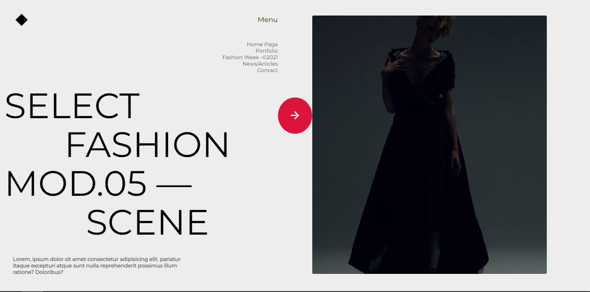

<h1 id="fashion-week-concept-website">Fashion Week Concept Website</h1>

Welcome to the Fashion Week Concept Website project! This website showcases a conceptual design for a fashion week event, highlighting the latest trends, designers, and runway shows.

<h2 id="table-of-contents">Table of Contents</h2>
<ul>
<li><a href="#overview">Overview</a></li>
<li><a href="#demo">Demo</a></li>
<li><a href="#features">Features</a></li>
<li><a href="#installation">Installation</a></li>
<li><a href="#usage">Usage</a></li>
<li><a href="#contributing">Contributing</a></li>
<li><a href="#license">License</a></li>
</ul>
<h2 id="overview">Overview</h2>

The Fashion Week Concept Website is a static website built using HTML and CSS. It provides a visually appealing interface to showcase the concept of a fashion week event. The website is designed to be responsive and user-friendly.

<h2 id="demo">Demo</h2>

Explore the live demo of the Fashion Week Concept Website:

<a href="https://antra77.github.io/Fashion-Week-Concept/">Live Demo</a>

<h2 id="features">Features</h2>
<ul>
<li><strong>Homepage:</strong> A visually appealing landing page introducing the fashion week concept.</li>
<li><strong>Event Schedule:</strong> Explore the schedule of runway shows, events, and designer spotlights.</li>
<li><strong>Designer Profiles:</strong> Learn more about featured designers with dedicated profile pages.</li>
<li><strong>Trends Gallery:</strong> A gallery showcasing the latest fashion trends with images and descriptions.</li>
<li><strong>Contact Page:</strong> Connect with the organizers or inquire about participation.</li>
</ul>
<h2 id="installation">Installation</h2>

To run the Fashion Week Concept Website locally, follow these steps:

<ol>
<li>Clone the repository:</li>
</ol>

git clone <a href="https://github.com/your-username/fashion-week-website.git">https://github.com/your-username/fashion-week-website.git</a>
cd fashion-week-website

<ol start="2">
<li>Open the index.html file in your preferred web browser.</li>
</ol>
<h2 id="usage">Usage</h2>

Feel free to customize the website to fit your specific fashion week concept. Update content, images, and styles to reflect your vision. The website is designed to be easily modifiable.

<h2 id="contributing">Contributing</h2>

We welcome contributions to enhance the Fashion Week Concept Website. If you have suggestions, find a bug, or want to add new features, please follow the contribution guidelines.
Fork the repository.
Create a new branch (git checkout -b feature/your-feature).
Make changes and commit them (git commit -am &#39;Add some feature&#39;).
Push to the branch (git push origin feature/your-feature).
Create a new pull request.

<h2 id="license">License</h2>

This project is licensed under the MIT License.

Feel free to customize this template based on your project&#39;s specific needs. Good luck with your Fashion Week Concept Website! 🌟

